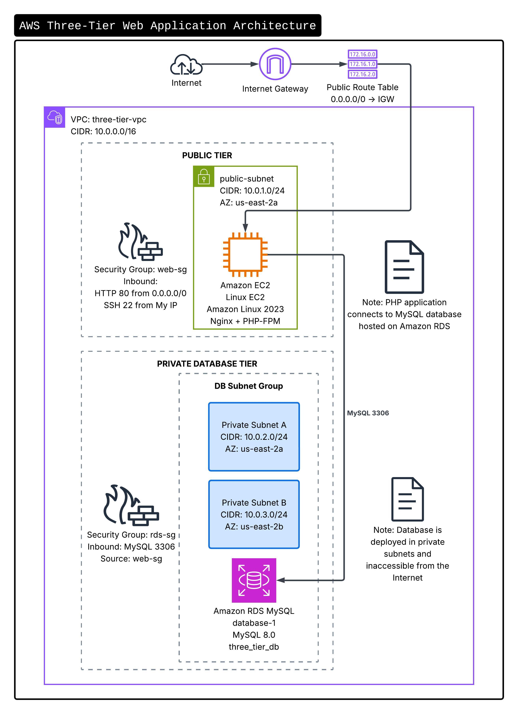

# AWS Three-Tier Web Application Architecture

## Project Overview

This project demonstrates the design and deployment of a secure Three-Tier Web Application Architecture on Amazon Web Services (AWS). The environment consists of a web tier hosted on Amazon EC2, an application layer using PHP and Nginx, and a database tier using Amazon RDS MySQL deployed within private subnets.

The objective of this project was to gain hands-on experience with AWS networking, compute, security, and database services while implementing industry-standard architecture principles.

---

## Architecture

---

### Components

- Amazon VPC
- Internet Gateway
- Public Subnet
- Private Subnet A
- Private Subnet B
- Route Tables
- Security Groups
- Amazon EC2 (Amazon Linux 2023)
- Nginx Web Server
- PHP-FPM
- Amazon RDS MySQL
- DB Subnet Group

### Architecture Flow

Internet → Internet Gateway → EC2 (Nginx + PHP) → Amazon RDS MySQL

---

## AWS Services Used

| Service | Purpose |
|----------|----------|
| VPC | Isolated networking environment |
| Public Subnet | Hosts web server |
| Private Subnets | Hosts database resources |
| Internet Gateway | Provides internet access |
| Route Tables | Controls network routing |
| Security Groups | Firewall controls |
| EC2 | Application hosting |
| RDS MySQL | Database backend |
| Nginx | Web server |
| PHP-FPM | Dynamic content processing |

---

## Network Design

### VPC

CIDR Block:

10.0.0.0/16

### Public Subnet

10.0.1.0/24

### Private Subnet A

10.0.2.0/24

### Private Subnet B

10.0.3.0/24

---

## Security Configuration

### Web Security Group

Inbound Rules:

- HTTP (80) from 0.0.0.0/0
- SSH (22) from administrator IP

### Database Security Group

Inbound Rules:

- MySQL (3306) from Web Security Group

This configuration ensures that the database is not directly accessible from the internet.

---

## Database Configuration

Engine:

MySQL Community Edition

Instance Type:

db.t4g.micro

Database:

three_tier_db

Table:

visitors

Sample Record:

| ID | Name |
|----|------|
| 1 | Jason |

---

## Application

The application uses PHP to connect securely to Amazon RDS and retrieve data from the visitors table.

Example Output:

RDS Connection Successful

ID: 1 Name: Jason

---

## Deployment Steps

1. Create custom VPC.
2. Create public and private subnets.
3. Attach Internet Gateway.
4. Configure route tables.
5. Launch EC2 instance.
6. Install Nginx and PHP-FPM.
7. Create RDS subnet group.
8. Deploy RDS MySQL instance.
9. Configure security groups.
10. Create database and table.
11. Deploy PHP application.
12. Validate connectivity between EC2 and RDS.

---

## Project Validation

Successfully validated:

- EC2 connectivity
- Nginx web hosting
- PHP execution
- RDS MySQL connectivity
- Database query execution
- Secure communication between application and database tiers

---

## Skills Demonstrated

- AWS Networking
- VPC Design
- Route Tables
- Security Groups
- Amazon EC2
- Amazon RDS
- Linux Administration
- Nginx Configuration
- PHP Development
- MySQL Administration
- Troubleshooting and Debugging

---

## Future Enhancements

- Application Load Balancer (ALB)
- Auto Scaling Group
- NAT Gateway
- HTTPS using ACM Certificates
- AWS Systems Manager
- CloudWatch Monitoring
- Infrastructure as Code (Terraform)

---

## Author

Jason Soundara Rajan
